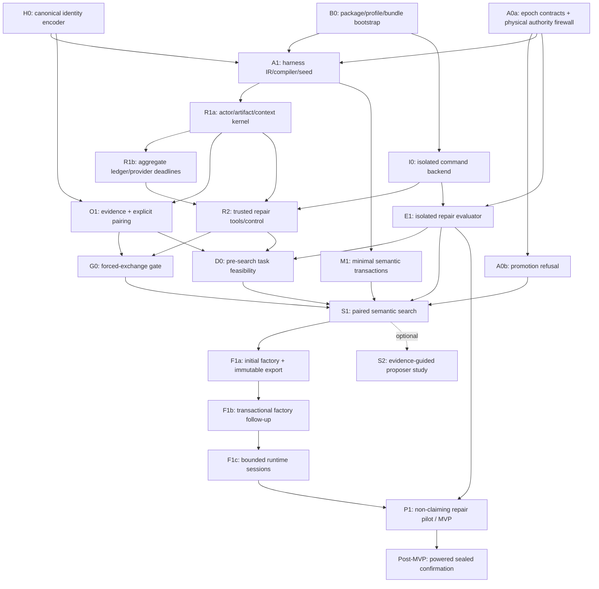

# Agintor Fastest Path to a Credible MVP

- Status: active master execution plan
- Code snapshot: `d291f353ae17c87b3240432d8a9dcf94d05cc04d`
- Prepared: 2026-07-10

This document controls **MVP scope, ordering, and release gates**. The live code and [`AGENTS.md`](../AGENTS.md) remain authoritative for current behavior and architecture boundaries. The [Secret Sauce research](<Secret Sauce Research/README.md>) remains the detailed mechanism and scientific-proof authority. The [per-file audit](<Agintor Code Descriptions/File Problems.txt>) is the issue inventory for snapshot `d291f353ae17c87b3240432d8a9dcf94d05cc04d`, and [`DEFERRED_ISSUES_LEDGER.md`](DEFERRED_ISSUES_LEDGER.md) remains the non-critical backlog. Neither inventory overrides later live code.

The purpose of this plan is to prevent two equally expensive mistakes:

1. fixing every audited defect before proving the product mechanism; or
2. implementing the entire Secret Sauce research program before there is a usable MVP.

## Executive decision

The fastest credible route is a single narrow product:

> **Agintor Repair Factory:** a factory that evolves bounded, executable collaboration protocols for audited Python repository repair, selects candidates using paired evaluator-owned outcomes, and exports a runtime that accepts a natural-language issue plus an immutable clean repository snapshot and returns a patch with auditable evidence.

The critical chain is:

```text
clean bootstrap
→ public/sealed authority boundary
→ small executable harness IR
→ consequential actor/artifact/tool behavior
→ causal Gate 0
→ paired external repair outcomes
→ one retained semantic descendant
→ factory/export/session productization
→ non-claiming MVP pilot
```

This is **not** a fix-all program. It is also **not** a full research-confirmation program. A powered one-shot sealed experiment remains the immediate post-MVP milestone and is required before making a strong capability or algorithm claim.

## What “MVP” means

Agintor is at MVP only when all of the following are true from a clean wheel installation:

1. A user creates a factory project for the explicit `repo-repair-v1` capability epoch.
2. The factory evaluates heritable `HarnessProtocol` candidates under one frozen model, fixed trusted tools, and one aggregate deployment/search envelope.
3. Every accepted mutation changes compiled executable semantics; inert changes are rejected before evaluation.
4. Candidate selection uses explicitly paired, evaluator-owned complete-repair outcomes. Trace quality never authorizes promotion.
5. The selected protocol is exported as a frozen runtime with source, compiled, dependency, search-lineage, and evidence identities.
6. Given a public issue, clean repository snapshot, and public reproduction information, the runtime uses differentiated actors, delivers at least one immutable artifact into a downstream call, runs bounded real tools, and emits a patch.
7. The evaluator applies that patch to a separate clean fixture and produces the authoritative outcome receipt.
8. Gate 0 demonstrates that exchanged content is consequential, not merely logged.
9. At least one non-prompt semantic child is retained because it improved an external paired development outcome without exceeding the fixed envelope.
10. A serial factory follow-up can produce a new validated release without corrupting the prior one; a runtime follow-up continues the named session and a new runtime chat starts independently.
11. A small, blinded, **non-claiming** repair pilot establishes task validity, isolation, headroom, cost truthfulness, mutation yield, intervention health, and reproducibility.

The allowed MVP statement is narrow:

> Agintor builds, evaluates, evolves, and exports bounded executable repair protocols with auditable, consequential artifact exchange.

The MVP does **not** establish that multi-agent systems are generally better, that the evidence-guided proposer is superior, or that one search algorithm reliably finds better systems. Those require the separate sealed confirmation defined in [`03_FIRST_PROOF_EXPERIMENT.md`](<Secret Sauce Research/03_FIRST_PROOF_EXPERIMENT.md>).

## Why this is the fastest credible scope

External research reinforces the local audit’s core conclusion:

- ADAS separates the **search space, search algorithm, and evaluation function**. Agintor must first make its search representation behaviorally executable and its evaluator authoritative; optimizer sophistication cannot repair an inert phenotype ([Hu et al., ADAS](https://arxiv.org/abs/2408.08435)).
- SILO-BENCH reports a communication-reasoning gap: agents may communicate extensively without integrating peer information. Therefore, artifact delivery logs alone are insufficient; the MVP needs matched content interventions ([Zhang et al., SILO-BENCH](https://aclanthology.org/2026.acl-long.1354/)).
- Agentless demonstrates why a simple localization/repair/validation pipeline must be a serious baseline. More orchestration is not value unless it beats a strong equal-opportunity simple rival ([Xia et al., Agentless](https://arxiv.org/abs/2407.01489)).
- SWE-bench provides an execution-grounded repair task shape, but public benchmark contamination and flawed tests can invalidate conclusions. Agintor therefore needs fresh or independently audited tasks and evaluator-owned clean fixtures, not a leaderboard shortcut ([SWE-bench](https://arxiv.org/abs/2310.06770), [OpenAI’s 2026 SWE-bench Verified audit](https://openai.com/index/why-we-no-longer-evaluate-swe-bench-verified/)).
- Repeatedly queried holdouts become adaptive training signal. V1 therefore has development data and one untouched confirmation set—no “shadow” set that silently drives selection ([Dwork et al.](https://arxiv.org/abs/1506.02629)).
- Early stopping and resource allocation can accelerate search only when low fidelity predicts the full objective. Racing stays disabled until the pilot measures that relationship ([Li et al., Hyperband](https://www.jmlr.org/papers/v18/16-558.html)).

## Current starting point

The project is not a greenfield rewrite. It already has useful host, protocol, provider, tooling, receipt, storage, session, Oracle, and repo-patch evaluator substrate. The fastest plan reuses those owning services while replacing the behaviorally thin claim path.

Current release blockers verified at the snapshot include:

- `default_runtime_profile()` fails because source-side profile loading requires the absent ignored `agintor/templates/baseline_runtime/runtime_profile.json`.
- `pyproject.toml` references a missing top-level `README.md`.
- factory planning/export still loads the absent policy-module baseline even for the spec-backed path.
- the SDK bundle omits `contracts/evidence.py` although bundled LangGraph state imports it.
- `TaskRuntime` compiles an `ExecutionPlan` and bypasses it when a runtime spec is present.
- the spec-backed operation service can echo the prompt, manufacture `verified=True`, return `not_bound`, and report no-op success.
- the wide `RuntimeSpec` and current `SpecAction` mutations include fields with no executing consumer.
- the provider-backed spec mutator does not yet provide a real evidence-guided proposal path.
- generic Oracle/process evidence can exist without concrete goal-outcome authority.
- parent/child evidence pairing, resource accounting, export replacement, isolation, and sealed-data boundaries are not strong enough for a capability claim.

These failures mean the present CLI surface is not an honest end-to-end product demo. They do **not** mean all audited issues must be fixed before useful progress.

## Frozen V1 product surface

### Supported

- Python 3.12 repositories with deterministic public reproduction/tests.
- Fresh or independently audited cross-component repair tasks.
- One explicit capability epoch: `repo-repair-v1`.
- One frozen hosted-model deployment, decoding policy, and price schedule per epoch.
- One runtime kind: `harness`.
- One trusted shared kernel and one sequential composite scheduler. Logical fork/join is supported; generic parallel scheduling is not required.
- Two or three differentiated actors.
- Bounded immutable text/structured artifacts with exact delivery and read evidence.
- Fixed file search/read, public-test shell, workspace-edit, and patch/diff tools.
- At most one bounded critique/revision route plus explicit success/failure/exhaustion termination.
- One aggregate ledger for calls, input/output/cached tokens, known/estimated/unknown dollars, tools, output bytes, retries, latency, and deadline.
- A small transactional mutation set and `(1+λ)` incumbent search or a tiny fixed beam.
- Evaluator-owned clean-copy patch application and scoring.
- Serial factory builds/follow-ups and basic runtime session continuation/separation.

### Explicitly unsupported

Unsupported features must fail at validation or configuration time; they must not remain dormant “supported” options.

- arbitrary task domains and generic goal-to-canned-benchmark inference;
- `policy_modules`, `langgraph_spec`, and `tradingagents_langgraph` as user-selectable V1 runtime kinds;
- transfer-scored episodes and transfer resume/group identity;
- generated Python tools or code-as-genome;
- service actions and arbitrary runtime network access;
- model/provider/temperature or long-term-memory evolution;
- arbitrary routing, cycles, async tools, or generic branch/resume machinery;
- MAP-Elites, islands, crossover, learned predictors, learned critics, or population claims;
- pairwise/LLM preference, schema-only, trace-only, metamorphic, or other non-repair promotion authority;
- adaptive validation/shadow feedback;
- compatibility migrations for disposable MVP specs, checkpoints, or exports;
- whole-runtime local/Docker parity, candidate preview UX, and multi-writer/concurrent factory operation.

## Contract freeze

All implementation work must share these boundaries under the single `RUNTIME_CONTRACT_VERSION`:

| Contract | Owns | Forbidden content |
|---|---|---|
| `ResearchEpochManifest` | scoped capability, task/split digests, model/provider/price identity, deployment and search envelopes, tools, mutation surface, feedback rules, margins, stop rule | mutable post-result thresholds |
| `TaskEnvelope` | public issue, clean workspace snapshot reference, public reproduction, allowed capabilities, ceilings | target files, expected answer, gold patch, hidden checks, evaluator-authored operation DAG |
| `EvaluationContract` | sealed fixture, protected paths, hidden checks, scoring, exclusions, outcome authority | any serialization into runtime or proposer inputs |
| `HarnessProtocol` | actors, differentiated views/instructions, artifact channels, fixed tool authority, bounded control, aggregate-budget shares, termination | evaluator decomposition, arbitrary code, unsupported fields |
| `CompositeRunPlan` | concrete actor calls, exact context reads, artifact writes/deliveries, tool actions, fork/join, bounded revision, public verification, termination, ledger | sealed data or silently ignored protocol fields |
| `RunEvidence` | actual delivered values/digests, reads, routes, calls, tools, receipts, usage, health, environment, termination | declared-but-unobserved consumption |
| `PairKey` | `task_manifest_id`, `environment_id`, `sampling_replicate`, `provider_config_digest` | positional/list-order identity |
| `OutcomeReceipt` | pair key, protocol/compiler/kernel/tool/task/patch digests, complete-repair result, health, exclusions, cost | solver-reported success as authority |
| `SemanticTransaction` | parent compiled digest, one hypothesis, normalized patch, preconditions, budget rebalance, dependencies, inverse/reversion | field edits with no consumer or budget expansion |

The current `ExecutionPlan` may donate low-level operation primitives, but it is not the genome. LangGraph may later schedule a `CompositeRunPlan`; it does not own a second prompt, tool, verification, budget, or artifact implementation.

## Dependency graph and parallel work



After B0, I0 can establish shared command isolation while A0a/A1 freeze semantic interfaces. Then the R1a runtime lane, E1 evaluator lane, and M1 mutation lane can proceed in parallel. R1b, R2, and O1 begin only after R1a freezes the actor/artifact/context interfaces; R2 also requires I0. S1 is the merge point. Search does not start merely because mutation code exists; A0b, M1, G0, and D0 must all pass first.

## PR-sized work packages

### B0 — Package, profile, and immediate bundle bootstrap

**Owners:** `runtime/profile.py`, `runtime/project.py`, `runtime/sdk/bundle.py`, `factory/planning.py`, `pyproject.toml`, package resources.

**Deliver:**

- make `runtime/sdk/defaults/runtime_profile.json` the canonical packaged profile;
- add the missing top-level package README or change package metadata to an existing authoritative README;
- remove every clean-source dependency on ignored `templates/baseline_runtime/`;
- fix the immediate SDK import closure, including `contracts/evidence.py`, and add a source-hidden import smoke;
- stop factory planning from loading the absent policy-module template before runtime-kind-specific work.

Do not build a general dependency crawler for dormant LangGraph modules. A1 defines the compiler/seed entrypoints, R2 adds the runtime service closure, and F1a owns the final source-hidden clean-wheel bundle gate.

**Gate:** from both a source checkout and installed wheel, load the default profile, build a minimal tracked SDK fixture, hide the source tree, import its declared modules, and reject a missing or mismatched file.

### H0 — Canonical identity encoder

**Owners:** `utils.py`, new contract digest helpers, `core/versioning.py`.

**Deliver:** one recursive, type-tagged canonical encoder for the new task, protocol, composite-plan, environment, provider-config, transaction, and evidence identities. It must deterministically encode nested mappings, sets, paths, bytes, and scalar types without cross-type collisions. Leave unrelated legacy hashes alone until their paths are retired.

**Gate:** cross-process/order tests prove stable output; bytes versus strings, nested sets, paths, and differently typed equivalent-looking values cannot collide.

### A0a — Epoch contracts and physical authority firewall

**Owners:** new/current contracts, public task loading, `oracle/package_io.py`, public projection helpers.

**Deliver:**

- implement `ResearchEpochManifest`, `TaskEnvelope`, and evaluator-only `EvaluationContract`;
- make `repo-repair-v1` the only promotion-capable epoch;
- reject generic goals without an explicit supported capability epoch; do not infer capabilities from keywords or route them to canned tasks;
- make factory, runtime, and proposer processes physically incapable of loading `EvaluationContract` or sealed fixtures; build `TaskEnvelope` independently from public inputs;
- recursively allowlist public projections and scan the final payload for sealed keys and canary values as defense in depth;
- enforce exactly two data states: development and untouched sealed confirmation.

**Gate:** the public-task loader rejects hidden/evaluator fields; factory/runtime/proposer processes start without sealed mounts or imports; a canary cannot appear in `TaskEnvelope`, runtime requests, or proposer packets.

### A0b — Outcome-authority and promotion refusal

**Owners:** `factory/planning.py`, `factory/pipeline.py`, `oracle/compiler.py`, `oracle/qa.py`, `evaluation/evaluator.py`, `search/archive.py`.

**Deliver:** mark demo/generated-operation suites as executor regressions only; require an epoch-pinned evaluator-owned `OutcomeReceipt` for capability promotion; make process integrity and no-leakage health floors rather than quality authority; reject crossed epoch/evaluator digests.

**Gate:** a process-perfect trace without a concrete outcome receipt cannot promote; a diagnostic-only score cannot select a child; replacing the pinned epoch/evaluator digest fails closed. F1 separately proves sealed canaries are absent from the final export.

### A1 — Harness IR and composite compiler spike

**Owners:** preferably new `contracts/harness.py` and `runtime/api/composite_compiler.py`, plus `contracts/execution.py` for concrete execution primitives.

**Deliver:**

- introduce the minimal `HarnessProtocol` and deterministic `CompositeRunPlan` compiler;
- retain only actor, view, instruction, artifact-channel, fixed-tool, budget-share, one revision, and termination fields;
- compute separate source and compiled semantic digests plus a runtime dependency manifest;
- emit a consumed-field/liveness manifest;
- add a typed canonical seed reference and one tracked two-actor seed, never an ignored generated source directory;
- bundle the compiler/contracts/seed metadata needed for this spike; R2 adds runtime services and F1a owns the final source-hidden clean-wheel bundle gate;
- reject unsupported/inert fields and exact compiled no-ops.

**Gate:** the same unstructured `TaskEnvelope` plus two protocols compiles into two distinct normalized plans and semantic digests; neither contains repair decomposition or sealed data; perturbing every mutable field changes its named normalized-plan consumer; the tracked seed and compiler metadata bundle/load through the B0 package path. R1/R2 perturbation tests prove execution effects, and G0 is the integrated liveness gate.

If this spike cannot make every field live, shrink the IR. Do not add fields to make the schema look complete.

Retire the current wide `RuntimeSpec` and task-operation `plan_compiler` from the V1 claim path rather than extending either into a second genome. Delete their public runtime-kind options at F1 cutover.

### R1a — Shared-kernel actor, artifact, and context slice

**Owners:** `runtime/kernel/base.py`, kernel loop/context services, `runtime/api/context.py`, `runtime/langgraph/*` only as removable adapter code.

**Deliver:**

- remove the spec branch that compiles and then bypasses the plan;
- implement one kernel-owned actor-call service used by the V1 sequential scheduler; any later scheduler must call this same service;
- implement the minimal straight-line `CompositeRunPlan` scheduler needed to execute two actor calls and one artifact delivery;
- add a run-local immutable artifact store with producer, payload digest, provenance, intended/actual consumers, visibility, schema, and size limits;
- write a pre-call context manifest containing exact artifact values and digests before provider invocation.

**Gate:** two actors receive different normalized views; actor B’s recorded pre-call context contains actor A’s exact artifact value and digest; undeclared/undelivered artifacts cannot enter context.

### R1b — Aggregate ledger, provider deadline, and secret transport

**Owners:** kernel budget services, `runtime/api/context.py`, the selected V1 provider adapter, provider accounting and credential transport.

**Deliver:**

- enforce one aggregate calls/tokens/dollars/tools/retries/deadline ledger;
- preserve known/estimated/unknown cost status on failures;
- tie provider request timeout/cancellation to the remaining wall-clock deadline;
- keep credentials as references in host dispatch and absent from durable request files, traces, receipts, and repository-test environments;
- make ambiguous post-send cost/usage unhealthy and promotion-ineligible rather than converting it to zero.

**Gate:** aggregate usage reconciles; budget exhaustion prevents the next action; a hung provider call is cancelled at the remaining deadline; known, estimated, and unknown costs remain distinguishable in shaped failures.

### I0 — Shared isolated command backend

**Owners:** a new infrastructure-only package such as `agintor/isolation/commands.py` plus its container launcher. It owns containment mechanics, not solve, tool, evaluator, or scoring semantics.

**Deliver:** run a fixed command against an explicitly mounted scratch root in a prebuilt digest-pinned image as an unprivileged user, with dropped capabilities, PID/memory/CPU/output/time limits, read-only base filesystem, no network, minimal mounts/environment, and descendant cleanup. Forbid Docker builds from candidate repository context.

**Gate:** traversal, host absolute paths, extra mounts, network, environment-secret access, fork bombs, memory/CPU/output overrun, timeouts, and orphan descendants are contained and reported with typed terminal status. R2 and E1 must both call this backend rather than implement isolation independently.

### R2 — Trusted repair tools and minimal control

**Owners:** `runtime/tools/registry.py`, `runtime/tools/executor.py`, `runtime/tools/safety.py`, `runtime/kernel/tooling.py`, `runtime/kernel/verification.py`, `runtime/kernel/side_effects.py`, composite executor, I0 adapter.

**Deliver:**

- fixed workspace-bound file search/read, public-test shell, edit, and diff tools;
- extend R1a’s scheduler with logical fork/join, one critique/revision route, public verification, and explicit termination;
- real receipts and budget charges for every action;
- no `not_bound`, `noop`, unconditional `verified=True`, or manufactured success path;
- actors receive the raw public task and an isolated working copy of an immutable repository snapshot and must localize the fault; no target-file or operation graph is supplied;
- all edits/tests occur in scratch, the supplied repository remains unchanged, and the final artifact is a diff against the immutable base;
- candidate repository code and tests execute through the same low-level `IsolatedCommandBackend` later used by E1.

**Fastest safe execution topology:** `RuntimeHost` dispatches the trusted SDK subprocess; that subprocess owns solve semantics, the shared kernel, and provider client. Repository commands run in a separate prebuilt, digest-pinned container as an unprivileged user with dropped capabilities, PID/memory/CPU limits, read-only base filesystem, no network, descendant cleanup, and only the minimal scratch mounts. The searchable protocol is data, not code. Never use the repository root as a Docker build context, and never place provider credentials in the command container. Whole-runtime backend parity is post-MVP.

**Gate:** a fixed protocol inspects a raw repository, runs a real public reproduction/test, revises at most once, terminates inside the envelope, and returns a patch/diff artifact. Traversal, absolute host reads, protected-path writes, network access, hangs, and environment-secret reads fail.

### E1 — Evaluator-owned clean repair lane

**Owners:** `oracle/families/repo_patch.py`, `evaluation/runners/repo_patch_runner.py`, `evaluation/oracle_runner.py`, I0 adapter.

**Deliver:**

- immutable pre-fix fixtures and environment identities;
- independent application of the submitted patch to a fresh clean copy;
- frozen fail-to-pass and pass-to-pass commands;
- protected evaluator/test paths, no network, resource/process limits, and clean environment filtering;
- known-good, empty, escaping, tampering, and plausible-wrong-patch QA challenges;
- candidate-independent `OutcomeReceipt` generation;
- evaluator-owned scoring/application semantics separate from the backend, which only runs contained commands and has no solve or authority logic.

**Gate:** known-good patches pass; empty, wrong, escaping, and protected-path patches fail; the original fixture remains unchanged; runtime-visible mounts and manifests contain no hidden checks, target-location canaries, or gold-patch data.

This lane can proceed in parallel with R1a/R1b after both A0a and I0 pass. R2 and E1 must reuse the same containment primitive without sharing public versus sealed fixture state.

### O1 — Execution evidence, pairing, and interventions

**Owners:** evidence contracts, per-run manifests, `evaluation/progress_oracle.py`, minimal canonical raw-run storage.

**Deliver:**

- explicit `PairKey` joins instead of list position or truncation;
- fail-closed handling of missing, duplicate, unhealthy, or configuration-mismatched pairs;
- exact contexts, delivered/read artifacts, routes, calls, provider response IDs, tools, receipts, retries, costs, environment, patch, and termination in `RunEvidence`;
- one protocol-valid matched neutral artifact replacement for G0;
- one single-writer aggregation path over immutable per-run proof records—no state-store redesign on the critical path;
- explicitly disable checkpoint publication, derived state-store indexing, and trace rematerialization on the V1 proof path.

**Gate:** shuffling result order does not change comparison; deleting a pair fails the comparison; declared-but-undelivered artifacts cannot appear consumed; an auditor can walk from outcome receipt to exact task, protocol, compiler, kernel, model, tool, context, artifact, and patch evidence.

Add the self-generated content-null variant during P1/confirmation preparation only after the simpler neutral intervention is healthy.

### G0 — Forced-exchange conformance gate

No search occurs at this gate.

Freeze a generated panel with 32 independent items, at least four templates, and four paired sampling replicates per item. Each item supplies different private evidence to two calls; neither private view alone determines the answer. Compare intact exchange with a schema-, length-, call-, and priced-input-matched neutral artifact, plus private-view and full-information controls.

Pass only when:

- every deterministic digest/delivery/budget conformance case passes;
- hard-invalid rate is at most `2%` per arm and differs by at most `2` percentage points;
- the full-information control succeeds on at least `80%`;
- each private-view-only control succeeds on at most `25%`;
- intact exchange succeeds on at least `70%`;
- intact minus null is at least `30` percentage points; and
- the task-clustered one-sided `95%` lower bound is above `15` percentage points.

If G0 fails, stop search and repair the phenotype. Do not tune thresholds after seeing provider results.

### D0 — Pre-search development-task feasibility

Before spending the S1 search budget, audit a small development-only repair sample through the completed R2/E1/O1 path. Every inspected task is permanently development data.

**Deliver:** deterministic clean-environment replay; known-good/empty/plausible-wrong patch checks; protected-path and leakage audit; one strong equal-envelope single-actor run; measured headroom, health, wall time, and cost.

**Gate:** evaluator outcomes are reproducible; known-good patches pass and wrong controls fail; no sealed data crosses the boundary; the strong baseline is neither saturated nor uniformly failing; projected paired-search cost fits the frozen budget. Otherwise stop before S1 and repair or abandon the task lane.

### M1 — Minimal semantic transactions

**Owners:** replacement for `contracts/spec_actions.py`, `search/spec_mutator.py`, compiler validation.

Implement only:

- actor split;
- channel add/rewire;
- critique/revision insertion or removal;
- explicitly labeled instruction rewrite as the prompt-only control.

Every structural transaction rebalances shares inside the same total envelope and records applicability, one mechanism hypothesis, normalized patch, predicted trace consequence, dependencies, and a validated inverse/reversion.

**Gate:** every accepted transaction changes the compiled semantic digest and executes; invalid, inert, budget-expanding, and dependency-invalid changes fail before evaluation; reversion is mechanically valid or explicitly non-revertible.

Do not implement tool-duty movement, termination mutation, arbitrary merges/routing, standalone budget mutations, the full operator catalog, or crossover until development failures show that degree of freedom is needed.

### S1 — Minimal paired semantic search

**Owners:** simplified spec branch of `search/engine.py`, evaluator, lineage ledger.

**Algorithm:** `(1+λ)` incumbent search or a tiny fixed beam over a frozen candidate budget. Every candidate gets a common task-stratified paired panel. Selection is lexicographic:

1. reject invalid, unsafe, unhealthy, or over-budget candidates;
2. compare evaluator-owned complete-repair outcomes;
3. inside a frozen outcome-equivalence region, prefer lower cost/latency and then the simpler protocol.

Trace diagnoses may inform the next proposal but never select a candidate. No validation/shadow result advances search. Racing remains off.

Implement frozen controls through the same model, tool, task, and accounting boundary: equal-envelope single actor, repeated single-actor sampling with a fixed public selector, static localization→repair→validation pipeline, founding parent, prompt-only transactions, and matched random semantic transactions without evidence guidance.

**Gate:** at least one executable semantic child is evaluated against its parent on exact pairs; an outcome-improving non-prompt child becomes an eligible parent; failed candidates cannot contaminate the leader; all controls receive their locked equal opportunities; the run stops at the frozen budget and preserves every candidate/outcome/decision.

If tasks show no headroom or valid-mutation yield is too low, stop with a feasibility result instead of adding optimizer machinery.

### S2 — Optional evidence-guided proposer study

S2 is **not an MVP dependency**. Only after S1 works with deterministic/matched-random transactions, optionally add one frozen provider-backed proposer. Its bounded packet may contain the parent protocol/digest, last transaction, paired outcome/cost facts, selected trace diagnoses/interventions, applicable operators, and hard constraints. It may not receive sealed data, raw repositories, unbounded histories, or an evaluator answer.

Run a matched random applicable-transaction control through the same compiler, validator, budget, and candidate opportunity. Label prompt-only transactions separately.

**Study gate:** the provider is actually invoked on the evidence-guided path; it returns typed transactions; proposer requests/responses are validated and recorded; both proposer and random routes pass identical validation/no-op rules; search works even if the proposer loses. One search may select an artifact, but it cannot establish proposer superiority.

### F1a — CLI, initial factory build, and immutable export

**Owners:** `cli.py`, `factory/planning.py`, `factory/pipeline.py`, `factory/export.py`, runtime profile/project layout.

Do this after the mechanism works; do not preserve the old factory path merely for CLI continuity.

**Deliver:**

- add an explicit capability-epoch input to the initial `build-runtime`; pin the epoch and deployment in the release;
- make `eval` and `solve` derive authority/deployment from that release and accept at most a matching digest assertion, never an independently selectable epoch/provider/model/profile;
- add a structured `--task-envelope` input and keep its immutable repository snapshot separate from the run-artifact workspace; materialize a scratch copy before any actor-visible edit;
- make `harness` the sole/default V1 runtime kind;
- remove/reject the old runtime kinds at this cutover rather than maintaining aliases;
- factory chat owns the epoch, search ledger, protocol lineage, and frozen selected runtime;
- exported runtime contains a frozen `HarnessProtocol`, source/compiled identities, dependency manifest, and evidence index;
- complete the final V1 runtime bundle closure and prove source-hidden imports from the built wheel;
- publish content-addressed immutable release generations under the factory project and atomically replace only a small validated active-release pointer;
- keep factory chat and runtime sessions outside immutable release directories;
- allocate unique implicit solve workspaces and preserve the supplied repository snapshot unchanged.

**Gate:** a clean wheel performs an initial build; the active pointer names a fully validated immutable generation; an injected failure before pointer advancement leaves the prior active generation untouched; sealed canaries are absent from the exported runtime and public evidence projection.

### F1b — Transactional serial factory follow-up

**Owners:** `factory/followups.py`, `storage/factory_chat_store.py`, active-release pointer store.

**Deliver:** one single-writer prepare/commit/abort/recover transaction that ties the factory-message commit to active-release pointer advancement. Persist records atomically. Concurrent writers remain rejected.

**Gate:** injected failures at every prepare/export/message/pointer boundary recover to one coherent chat message and active release; no orphaned committed message points at the wrong release.

### F1c — Bounded runtime session continuation

**Owners:** runtime session seed/context assembly and `storage/runtime_session_store.py`.

**Deliver:** atomic single-writer session updates; same-release continuation and new-session separation; bounded, deduplicated context/artifact references. Exclude predictor state, full prior patches, pause/resume, crash recovery, long-term-memory evolution, candidate preview, and concurrent writers.

Sessions are pinned to the immutable release digest that created them. Resolving an old session through a newer active release fails clearly; it is never silently migrated.

**Gate:** same-release continuation receives only the bounded declared carryover; new sessions share none; an old session is rejected after the active release changes; partial session writes recover without inventing history.

### P1 — Non-claiming repair pilot and MVP release

First run a small blinded task-audit sample. Every opened task becomes development data. Reserve one audited pilot task from search, consume it once for the non-confirmatory product run, and immediately reclassify it as development data; it is not a reusable shadow or sealed result. Measure:

- reproducibility, public/sealed authority, leakage, and wrong-patch rejection;
- single-agent baseline headroom and static-pipeline strength;
- environment health and repository independence;
- cost, latency, replicate and repository variance;
- valid semantic-mutation yield and retained-descendant frequency;
- neutral/self-generated intervention health;
- small-panel versus full-panel rank correlation.

Run the complete user workflow and freeze one demonstration evidence packet. The pilot is allowed to show development outcomes and causal G0 results, but it must be labeled non-confirmatory. Racing may be enabled only in a later epoch if rank correlation justifies it.

**MVP release gate:** B0, H0, A0a, A0b, A1, R1a, R1b, I0, R2, E1, O1, G0, D0, M1, S1, F1a, F1b, and F1c all pass; one non-prompt descendant is retained on paired external outcomes; the once-reserved pilot repair completes end-to-end; the pilot reveals no isolation, leakage, cost, or integrity failure; limitations and every required control outcome ship with the evidence. S2 is optional and is not a release gate.

If independent repositories or budget cannot support a later powered confirmation, the project may still release this research-preview MVP, but it must report feasibility rather than a general capability claim.

## Per-file issue disposition

Severity is not critical-path rank. The audit’s findings should be handled by ownership and gate impact:

| Issue family | MVP action | Reason |
|---|---|---|
| missing profile/template/README and incomplete bundle | fix in B0 | clean installation and any product run depend on them |
| weak canonical hashing and crossed execution/evidence identities | fix narrowly in H0/O1 | causal pairing and reproducibility depend on trustworthy identity |
| wide inert `RuntimeSpec`, structural `SpecAction`, compiled-plan bypass | replace in A1/M1 | these are the broken mechanism, not independent bugs to patch |
| echo/unconditional verification/unbound tool/no-op service | remove from the claim path in R1a/R2 | manufactured phenotype cannot support search |
| generic Oracle/process promotion and positional pairing | replace in A0b/O1 | external outcome authority is load-bearing |
| aggregate cost/tool/token/deadline accounting, secret transport, repo isolation | fix on the V1 path in R1b/I0/R2/E1 | proof validity and user safety depend on them |
| destructive/non-transactional export and shared solve workspace | replace/fix in F1a–F1c | product release and user data depend on them |
| transfer episodes, generic branches, generated tools, service actions, TradingAgents | disable/remove for V1 | not needed for the repair claim; several are unsafe or semantically broken |
| predictors, QD/islands/crossover, pairwise comparators, dormant prompts | remove/disable for V1 | no live control value; they create false surface area |
| full checkpoint/resume, state-store generations, durable Docker projections, global indexes | defer | one-shot candidate evaluation and serial product operation do not require them |
| long-term-memory/model/provider/tool evolution, open code genome | post-MVP research | adds confounds before the basic mechanism works |

No implementation PR may include an unrelated audited fix simply because the file is already open. Record it in the deferred ledger unless it blocks a named gate.

## Target user demo

These are target acceptance commands; they are not claimed to work at the current snapshot. `--epoch` and `--task-envelope` are target F1 behavior, not current CLI options. F1 may refine their names, but it must preserve this structured user story.

```powershell
py -3.12 -m venv .\_build_venv
.\_build_venv\Scripts\python -m pip install --upgrade pip
.\_build_venv\Scripts\python -m pip wheel . --no-deps --wheel-dir .\dist
$wheel = (Get-ChildItem .\dist\agintor-*.whl | Sort-Object LastWriteTime -Descending | Select-Object -First 1).FullName

py -3.12 -m venv .\_demo\venv
.\_demo\venv\Scripts\python -m pip install "${wheel}[hosted]"
$agintor = '.\_demo\venv\Scripts\agintor.exe'
```

```powershell
& $agintor build-runtime .\_demo\repair_factory `
  --prompt "Build a bounded collaborative runtime for audited Python cross-file repair." `
  --epoch .\examples\repair_mvp\repo-repair-v1.json `
  --runtime-kind harness `
  --steps 12 `
  --provider openai `
  --api-key-file '.\OpenAI API Key.txt' `
  --profile .\examples\repair_mvp\frozen-profile.json `
  --artifact-mode always
```

```powershell
& $agintor solve .\_demo\repair_factory `
  --task-envelope .\examples\repair_mvp\public-task.json `
  --workspace .\_demo\runs\repair-001 `
  --api-key-file '.\OpenAI API Key.txt' `
  --new-session `
  --artifact-mode always
```

`public-task.json` contains only the issue, immutable clean snapshot reference/digest, public reproduction, capability allowlist, and ceilings. The SDK materializes its own scratch working copy. The epoch/profile pins the provider, model, price schedule, and digest-pinned command-container policy; solve receives only a credential reference and cannot override deployment semantics. The output contains the submitted patch, public-check result, termination reason, usage, public evidence index, and session identity. Hidden checks and repair decomposition never enter the runtime request.

A same-release runtime follow-up occurs **before** rebuilding the factory project:

```powershell
& $agintor solve .\_demo\repair_factory `
  --task-envelope .\examples\repair_mvp\public-followup.json `
  --workspace .\_demo\runs\repair-001-followup `
  --api-key-file '.\OpenAI API Key.txt' `
  --session <session-id> --artifact-mode always
```

Then the serial factory follow-up publishes a new immutable active release. The old session is pinned to the prior release and must be rejected through the new active release; a new session starts independently:

```powershell
& $agintor build-runtime .\_demo\repair_factory `
  --prompt "Prefer lower-cost protocols when complete-repair outcomes are equivalent." `
  --steps 4 `
  --api-key-file '.\OpenAI API Key.txt' `
  --artifact-mode always

& $agintor solve .\_demo\repair_factory `
  --task-envelope .\examples\repair_mvp\public-followup.json `
  --workspace .\_demo\runs\old-session-rejection `
  --api-key-file '.\OpenAI API Key.txt' `
  --session <old-session-id> --artifact-mode always
# The preceding command must fail with a release/session identity mismatch.

& $agintor solve .\_demo\repair_factory `
  --task-envelope .\examples\repair_mvp\public-task-2.json `
  --workspace .\_demo\runs\repair-002 `
  --api-key-file '.\OpenAI API Key.txt' `
  --new-session --artifact-mode always
```

## Required evidence stores

```text
public_release_evidence/
  release_manifest.json
  capability_epoch_public.json
  protocol/source.json
  protocol/compiled_plan.json
  protocol/consumed_field_liveness_manifest.json
  runtime/dependency_manifest.json
  search/transaction_lineage_public.jsonl
  search/selection_decisions_public.jsonl
  gate0_report.json
  pilot_summary.json
  limitations.md

controlled_development_and_evaluator_evidence/
  evaluation_contract.json
  task_public_manifest.json
  evaluator/task_audit_manifest.json
  evaluator/outcome_receipts.jsonl
  runs/<pair-key>/run_manifest.json
  runs/<pair-key>/pre_call_contexts/
  runs/<pair-key>/artifacts/
  runs/<pair-key>/tool_and_side_effect_receipts.jsonl
  interventions/content_null_manifest.json
  proposer/validated_requests_and_responses.jsonl  # only if S2 runs
  analysis/raw_paired_outcomes.jsonl
  analysis/pilot_report.json
```

Only explicit public-safe projections and digests enter the exported runtime or public packet. Full contexts, artifact values, task audits, evaluator contracts, raw outcome records, and hidden material remain in access-controlled developer/evaluator storage. Reuse compatible current manifest/receipt field semantics, but permit a new immutable proof-record store rather than forcing broken checkpoint, state-index, or trace-rematerialization systems onto the V1 path. Derived indexes may be rebuilt; immutable raw proof records are authoritative.

## Verification strategy

Each work package adds a focused test file whose name matches its gate. Engineers read and run the focused slice before broadening verification.

Suggested target suite:

```text
tests/mvp/test_b0_clean_bootstrap.py
tests/mvp/test_h0_canonical_identity.py
tests/mvp/test_a0a_authority_firewall.py
tests/mvp/test_a0b_promotion_refusal.py
tests/mvp/test_a1_composite_compiler.py
tests/mvp/test_r1a_actor_artifact_context.py
tests/mvp/test_r1b_budget_provider_deadline.py
tests/mvp/test_i0_isolated_command_backend.py
tests/mvp/test_r2_repair_tools_and_control.py
tests/mvp/test_e1_isolated_repo_evaluator.py
tests/mvp/test_o1_pairing_and_interventions.py
tests/mvp/test_g0_deterministic_conformance.py
tests/mvp/test_d0_task_feasibility.py
tests/mvp/test_m1_semantic_transactions.py
tests/mvp/test_s1_paired_search.py
tests/mvp/test_s2_evidence_guided_proposer.py  # optional S2 study
tests/mvp/test_f1a_factory_export.py
tests/mvp/test_f1b_factory_followup_transaction.py
tests/mvp/test_f1c_runtime_sessions.py
tests/mvp/test_p1_end_to_end_repair_factory.py
```

Merge verification for each PR is its focused file plus directly affected existing contract tests. `test_g0_deterministic_conformance.py` validates scripted delivery/digest/budget semantics; the locked live-provider G0 panel is a separate experiment that produces `gate0_report.json` and raw controlled evidence. At the MVP release candidate, run the required full `tests/mvp` subset (excluding optional S2 when it is not run), built-wheel clean-install smoke, and evidence replay. Command-container tests run only for packages that own that boundary and at release.

## Stop, feasibility, and claim rules

### Hard engineering/release stops

- source-ignored files or the checkout remain necessary after B0;
- the bundle cannot import with source code hidden;
- a mutable field lacks a consumer and execution-observable perturbation test;
- a process-only or solver-reported result can promote;
- a sealed canary crosses the public boundary;
- G0 fails any locked validity, success, effect, or uncertainty threshold;
- tools bypass receipts/budgets, secrets enter artifacts, or repo code escapes isolation;
- the evaluator accepts empty, tampering, escaping, or plausible-wrong patches;
- usage cannot be reconciled or ambiguous post-send cost is recorded as zero;
- explicit pairs are missing/duplicated but a comparison still proceeds.

### MVP feasibility stops

- valid semantic descendants are too rare to support the frozen search budget;
- no outcome-improving descendant exists on development tasks with real headroom;
- the once-reserved product task cannot complete without violating isolation, authority, or the frozen envelope.

### Mandatory narrowing, not MVP blockers

- if the equal-envelope single actor, repeated sampling, or static repair pipeline matches the champion, do not claim multi-agent repair superiority;
- if prompt-only or matched random search matches the selected result, do not claim semantic-search or proposer superiority;
- if low-fidelity ranks do not predict full-panel ranks, keep racing disabled;
- if the corpus or budget cannot support powered confirmation, publish feasibility only;
- if any sealed result changes the harness, task set, threshold, comparator, or search, discard that confirmation epoch.

Negative results are product information. They are not permission to substitute trace volume, archive occupancy, or infrastructure completion for capability.

## Immediate execution order

The first merge sequence should be:

1. In parallel, **B0** makes package/profile/immediate-bundle behavior truthful and **H0** supplies canonical new identities.
2. **A0a** freezes the epoch contracts and physical public/sealed boundary; start **I0** as soon as B0 is available.
3. In parallel, **A0b** wires promotion refusal and **A1** completes the two-protocol compiler/seed spike; E1 begins after A0a and I0.
4. In parallel, start runtime **R1a**, evaluator **E1**, and mutation **M1**.
5. After R1a, complete **R1b**, **R2**, and **O1**; then execute **G0** and **D0**.
6. Only after A0b, M1, G0, and D0 pass: run **S1**.
7. After S1 retains a real descendant: deliver **F1a → F1b → F1c**.
8. Run **P1** and make the non-claiming MVP release decision.

**S2** may start as an optional study after S1; it does not delay F1 or P1.

No team should start full checkpoint redesign, QD/population search, broad Oracle cleanup, TradingAgents integration, or generalized provider/backend parity while this critical chain is open.

## Post-MVP: claim-bearing confirmation

After P1, use its measured variance, cost, task attrition, repository clustering, mutation yield, and intervention health to power the exact sealed design. Freeze `H*`, strongest equal-envelope single actor `S*`, founding parent `F`, admissible non-prompt semantic counterfactual `R*`, equal-search-opportunity no-semantic-descent artifact `N*`, primary exchange set `C*`, and both healthy content-null variants.

Run one evaluator-owned sealed batch on unseen repositories. The artifact-level claim is allowed only if all three family-wise-compatible gates pass:

1. `H*` clears the locked margin over `S*`;
2. `H*` clears every member of `{F, R*, N*}`; and
3. `H*` clears both healthy content-null variants.

If the available independent repositories or budget cannot provide the preregistered power, stop at the MVP and publish the feasibility limits. Do not dilute the claim or reuse the sealed set.

## Maintenance rule

Update this file only when a gate, dependency, or product-scope decision changes. Detailed mechanism reasoning belongs in `Dev Docs/Secret Sauce Research/`; individual non-critical defects belong in `DEFERRED_ISSUES_LEDGER.md`. When a work package closes, record the commit and evidence artifact beside its gate instead of adding a narrative implementation history.
